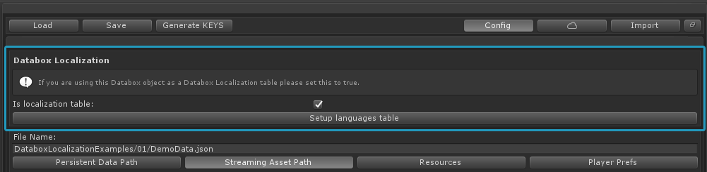

Getting started
===============

If it is your first time working with the Databox editor, 
it is highly recommended that you have a look at the Databox data editor documentation first. 

Please make sure you have installed the latest version of Databox - Data editor & save solution

**Installation and setup**

**Getting started video**
<iframe width="560" height="315" src="https://www.youtube.com/embed/vMbT8kTAAEI" frameborder="0" allow="accelerometer; autoplay; clipboard-write; encrypted-media; gyroscope; picture-in-picture" allowfullscreen></iframe>

Step by step
------------
1. Download and import the <strong>Databox - Localization addon</strong> from the package manager. 
2. Create a new Databox object by right click in the projects view and select: <strong>Create / Databox / new Databox object</strong>
3. Select the Databox object and go to the <strong>config menu.</strong>

  

4. Set "is localization table" to true. This will enable localization features for this specific Databox object.

It is recommended that you use only one dedicated Databox object for localization.

 

5. Make sure you have specified a save path and file name. More about save paths here: 
<a href="http://databox.doorfortyfour.com/documentation/concept_and_workflow">Databox concept and workflow</a>
6. Click on the "Setup languages table" button. This will add a default languages table to the Databox object.

  
Demo
=====

Demo scene is located inside of a separate Unity package located in the Databox - Localization folder.
