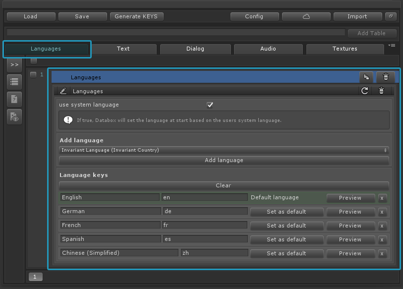
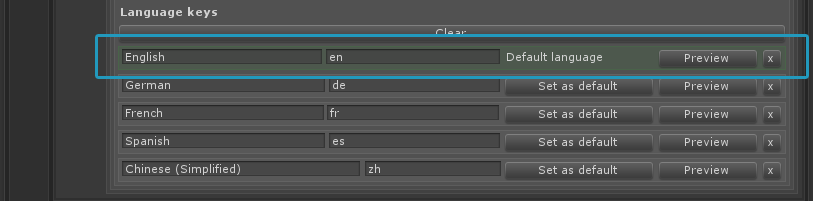

Languages
===============

1. Make sure you have a languages table. 
 **If you don't have a languages table you can create a new table and add a new entry of type languages or
simply go to the config menu and click on the "Setup languages table" button.**

 

 
2. Select the languages table. There you can find a new entry called languages. Select the entry. 
Here you can now easily add new languages by selecting them from the dropdown menu. These languages will be used for all localization entries.

 

 
3. Make sure to set a default language. 
It is important to set a default language. The default language will be used as a fallback language when "use user system language" is enabled. It is also used when using the Google Translate feature. 
