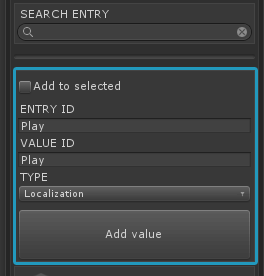
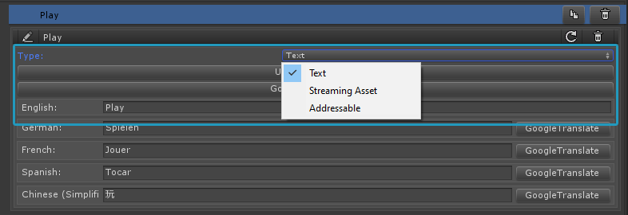

Add localization data
=====================

You 're now ready to add your localization data. (Text or Assets)  

1. Create a new table
2. Add a new entry of type localization.
 

 
3. The ValueID name can be the same as the EntryID name.  
You can use a different ValueID name to differentiate between build platforms. (pc, mobile... )
 

 
4. Select the new entry, and set the type of the localization: text, streaming asset or addressable.

* Text: Contains only string data
* Streaming asset: For Texture2D, AudioClips or AssetBundles
* Addressables: For any other object type which has an addressable path.

5. Click on update language - this will load the languages from the languages entry created in the last step.
6. Depending on the localization type you can now add text or drag and drop the assets to the appropriate fields. 

Google Translate
-----------------
Use the Google translate button to automatically translate the text. 

There might be cases where the Google Translate service won't be available instantly, causing a timeout.
In this case simply retry.

