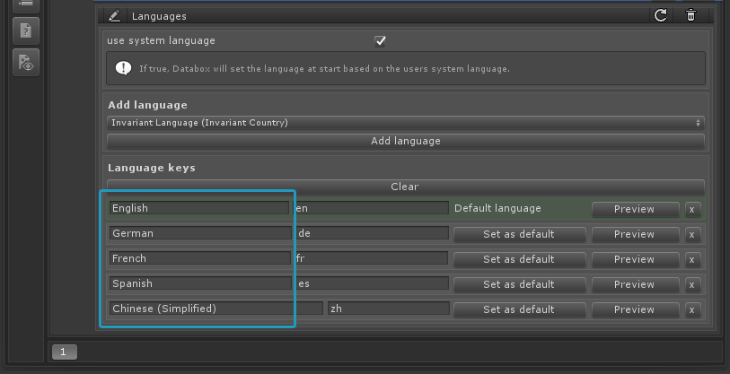

Change Language
===============

All runtime API methods can be called by using the DataboxLocalization manager.
To change the language at runtime simply call:

		DataboxLocalization.Instance.SetLanguage("language key");

The language key is the language name defined in the Languages tables for each language.

 

 