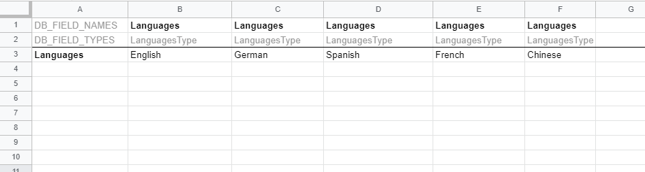
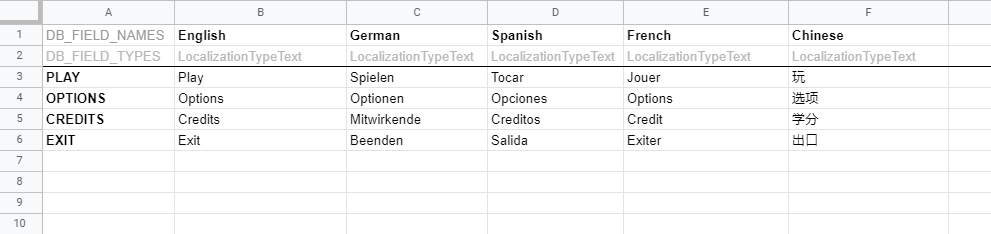

CSV & Google Spreadsheet import
================================

To make sure Databox - Localization recognizes the correct data types you will need to setup the spreadsheet correctly.

Use following keys to mark the appropriate fields:

**DB_FIELD_NAMES:** The actual name of the value/variable  
**DB_FIELD_TYPES:** The type of the value. In case of Databox Localization use: 
	- <strong>LanguagesType:</strong> language type 
	- <strong>LocalizationTypeText:</strong> for text type 
	- <strong>LocalizationTypeStreamingAsset:</strong> for streaming asset path 
	- <strong>LocalizationTypeAddressable:</strong> for addressables asset path 
**DB_IGNORE:** Mark rows and cells you don't want to import with this key.

Languages sheet
---------------
 

 

Localization sheet
------------------
 

 

For further information about how to import a CSV or Google spreadsheet, please read the official: <a href="http://databox.doorfortyfour.com/documentation/import/using%20spreadsheets">Databox - Data editor documentation</a>
